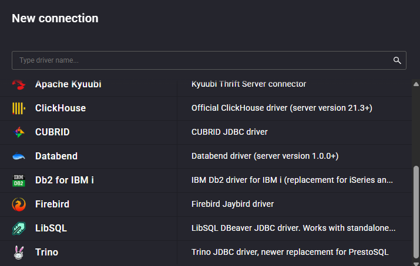

# cubrid-enabler-cloudbeaver

cubrid-enabler-cloudbeaver enables the [CUBRID](https://cubrid.org) Driver, which is not enabled by default when using [CloudBeaver Community](https://github.com/dbeaver/cloudbeaver).

## Installation
1. Install the CloudBeaver container via [Docker Hub](https://hub.docker.com/r/dbeaver/cloudbeaver).
Refer to the [CloudBeaver wiki](https://github.com/dbeaver/cloudbeaver/wiki/CloudBeaver-Community-deployment-from-docker-image) for installation instructions.

2. Copy the shell file (`cubrid-enabler.sh`) to the CloudBeaver installation folder (`/opt/cloudbeaver`) in the container.
3. Execute the shell file in the installation folder (`/opt/cloudbeaver`).
```
./cubrid-enabler.sh
```
4. It will be installed successfully as shown below.
```
./cubrid-enabler.sh
Created folder: /opt/cloudbeaver/drivers/cubrid
CUBRID JDBC driver extracted
Backup original file: /opt/cloudbeaver/server/plugins/io.cloudbeaver.resources.drivers.base_1.0.141.202603020941.jar
Backup successful: /opt/cloudbeaver/server/plugins/io.cloudbeaver.resources.drivers.base_1.0.141.202603020941.jar.1773182108.bak
Bundle replaced successfully
```
5. After that, restart the Docker container to enable CUBRID.

### Notes
#### [Recovery]
The modified file (`io.cloudbeaver.resources.drivers.base*.jar`) is backed up in the same folder.
If it does not work properly, please revert the installed file to the backup file and restart the Container.

```
Backup original file: /opt/cloudbeaver/server/plugins/io.cloudbeaver.resources.drivers.base_1.0.141.202603020941.jar
Backup successful: /opt/cloudbeaver/server/plugins/io.cloudbeaver.resources.drivers.base_1.0.141.202603020941.jar.1773182108.bak
```

#### [Copy to Docker Container]
docker cp c:\cubrid-enabler.sh (my-container-name):(path)

## Environment and Build
### Environment
[JAVA 21](https://adoptium.net/)
[Apache Maven (3.9.9+)](https://maven.apache.org/download.cgi)
[Node.js (LTS 22.15.0)](https://nodejs.org/)
[Yarn (4.x)](https://yarnpkg.com/getting-started/install)
[NPM](https://docs.npmjs.com/getting-started)


### Build
- Build
```
./build-enabler.sh
```
- Output Folder  
dist/cubrid-enabler.sh
